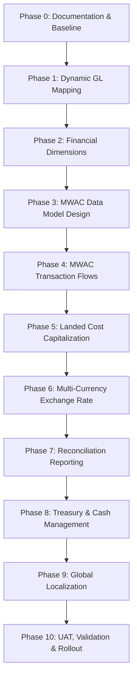

# ERP Accounting Modernization: Implementation Plan

**Document Status:** Pending Owner Review  
**Date:** June 4, 2026  
**Target Core ERP Standards:** Palestine (Bisan/Al-Shamel), GCC (SAMA/CBUAE compliance), Global (SAP B1, Oracle NetSuite, Odoo, Xero)

---

## 1. Executive Summary
This implementation plan outlines the sequential phases to modernize the Azad ERP financial core. The objective is to replace legacy ad-hoc costing (such as Last Purchase Cost snapshots) and hardcoded ledger postings with a highly disciplined, multi-tenant, dimensions-driven Perpetual Inventory and Dynamic General Ledger framework. This architecture aligns with mature, auditable international ERP standards (SAP Business One, Oracle NetSuite, Odoo) and regional market standards (Bisan, Al-Shamel). 

---

## 2. Project Scope

### A. Must Implement Now (This Modernization Phase)
1. **Dynamic GL Mapping:** Decouple posting logic from database account numbers using GL Concepts.
2. **Financial Dimensions:** Enforce dimension validation (`tenant_id`, `branch_id`, `warehouse_id`, `cost_center_id`, `profit_center_id`, `partner_id`, `currency`, `payment_channel`).
3. **True MWAC Inventory Costing:** Track Moving Weighted Average Cost per product per warehouse.
4. **Landed Cost Capitalization:** Capitalize and allocate freight, customs, handling, and insurance into inventory.
5. **Exchange Rate Policy:** Locking posted document exchange rates and standardizing online fallback feeds.
6. **Closed Period Locks:** Immutable historical transactions with reversal/adjustment-only workflows.
7. **Read-Only Stock-to-Ledger Reconciliation:** Monitoring and discrepancy reporting.

### B. Should Implement Later (Phase 2 Roadmap)
1. **Advanced Treasury:** Cashier cash box limits, employee advances sub-ledgers, and automated payment gateway reconciliations.
2. **E-Invoicing Compliance:** Standardizing XML/JSON exports for KSA ZATCA and Palestine Ministry of Finance audits.
3. **AI Pre-Payment Audit:** ML-driven anomaly detection for payroll and vendor payments.

### C. Requires Owner/Accountant Approval
1. **Opening Balances:** Migration baseline verification.
2. **Landed Cost Allocation Overrides:** Approving weight/volume allocation parameters.
3. **Manual Cost Overrides:** Authorized limits for unlinked sales returns.

### D. Explicitly Out of Scope
1. **FIFO Valuation Layer Tracking:** Banned by approved matrix DM-01.
2. **Asset Depreciation Calculations:** Handled in a separate Fixed Asset module roadmap.
3. **Direct Physical Adjustment Deletions:** All stock variances must be recorded via adjustments, never direct record deletions.

---

## 3. Implementation Order Recommendation & Dependency Map

To avoid database inconsistencies, the system must **NOT** begin with MWAC calculations. The safest and most logical implementation path is:



### Rationale:
* **Dynamic GL Mapping & Dimensions** must be established first so that when the MWAC transactions execute, they can immediately resolve accounts and tag dimensions.
* **Exchange Rate Framework** must precede reconciliation because valuation reports require stable multi-currency conversions.

---

## 4. Detailed Phased Roadmap

### Phase 0: Documentation Cleanup and Baseline Correction
*   **Goal:** Correct all precision rules references in documentation.
*   **Files Affected:** `docs/ERP_ACCOUNTING_DECISION_MATRIX.md`, `docs/ERP_ACCOUNTING_PRINCIPLES.md`, `docs/WAC_ACCOUNTING_ARCHITECTURE_REVIEW.md`.
*   **Migrations Needed:** None.
*   **Accounting Impact:** Establishes the rule: **MWAC stored precision = 6 decimals**, **Inventory calculations = 6 decimals internally**, and **Final journal amounts = currency-specific decimals**.
*   **Estimated Complexity:** Low.

---

### Phase 1: Dynamic GL Mapping Foundation
*   **Goal:** Replace all hardcoded account code lookups with dynamic mappings per tenant.
*   **Files Affected:** `models/gl.py`, `services/gl_service.py`, `services/gl_posting.py`.
*   **Models Needed:** `GLAccountMapping` (maps `concept_code` and `gl_account_id` per `tenant_id`).
*   **Services Affected:** `GLService`, `PurchaseService`, `SaleService`, `PaymentService`.
*   **Migrations Needed:** `create_gl_account_mappings_table`.
*   **Accounting Impact:** Decouples postings from specific account charts. Allows custom COA structures.
*   **Risks:** Unmapped mandatory concepts block sales.
*   **Rollback Strategy:** Revert lookup helper to fallback to hardcoded numbers if `GLAccountMapping` returns null.
*   **Test Cases:** Resolve `INVENTORY_ASSET` to correct account; raise `GLMappingError` for missing mappings.

---

### Phase 2: Financial Dimensions Enforcement
*   **Goal:** Validate and tag dimensions on every transaction line.
*   **Files Affected:** `models/gl.py`, `utils/gl_helpers.py`.
*   **Models Needed:** Add columns `branch_id`, `warehouse_id`, `cost_center_id`, `profit_center_id`, `partner_id` to `gl_journal_lines`.
*   **Migrations Needed:** `add_dimensions_to_gl_lines`.
*   **Accounting Impact:** Prevents chart tree explosion.
*   **Risks:** Operational processes fail if dimensions are missing.
*   **Rollback Strategy:** Make columns nullable during transition; log warnings instead of raising errors.
*   **Test Cases:** Post journal entry with `branch_id` and `cost_center_id`; verify database constraints.

---

### Phase 3: MWAC Data Model Design
*   **Goal:** Create the tables to store average costs per product per warehouse.
*   **Files Affected:** `models/product.py`, `models/warehouse.py`.
*   **Models Needed:** `ProductWarehouseCost` (active MWAC state), `ProductCostHistory` (audit trail).
*   **Migrations Needed:** `create_mwac_tables`.
*   **Accounting Impact:** Authoritative stock value state defined at `(product, warehouse)` level.
*   **Risks:** Redundant data synchronization issues with physical movements.
*   **Rollback Strategy:** Drop new tables; fall back to product-level cost columns.
*   **Test Cases:** Initialize a product in warehouse A; verify default cost and quantity are 0.

---

### Phase 4: MWAC Transaction Flows
*   **Goal:** Hook operational events (purchases, sales, transfers, adjustments) to MWAC recalculation.
*   **Files Affected:** `services/stock_service.py`, `services/sale_service.py`, `services/purchase_service.py`.
*   **Services Affected:** `StockService`, `SaleService`, `PurchaseService`.
*   **Migrations Needed:** None (logic update).
*   **Accounting Impact:** perpetual stock values and COGS reflect Moving Average Cost.
*   **Risks:** Concurrent stock receipts cause recalculation race conditions.
*   **Rollback Strategy:** Feature flag `ENABLE_MWAC` reverts calculations to legacy Last Purchase Cost.
*   **Test Cases:** Receipt of goods recalculates MWAC; sale reduces quantity without changing average cost.

---

### Phase 5: Landed Cost Capitalization
*   **Goal:** Allocate and capitalize freight, customs, clearance, insurance, and handling.
*   **Files Affected:** `models/purchase.py`, `services/purchase_service.py`.
*   **Models Needed:** `PurchaseLine` extended with `allocated_landed_cost`.
*   **Migrations Needed:** `add_landed_cost_to_purchase_lines`.
*   **Accounting Impact:** Acquisition costs increase inventory asset values rather than expensed.
*   **Risks:** Over-valuation of stock if wrong costs are input.
*   **Rollback Strategy:** Landed cost allocation returns 0; costs expensed directly to P&L.
*   **Test Cases:** Allocate 500 AED freight across 3 items by value; verify allocated sums.

---

### Phase 6: Exchange Rate Framework
*   **Goal:** Manage foreign purchases using locking rates and fallback online feeds.
*   **Files Affected:** `models/purchase.py`, `services/exchange_service.py`.
*   **Models Needed:** `ExchangeRateRecord`.
*   **Migrations Needed:** `create_exchange_rate_tables`.
*   **Accounting Impact:** Immutable foreign exchange rates on posted documents. Realized gains/losses to FX P&L.
*   **Risks:** Network failure blocks online rate fetch at creation.
*   **Rollback Strategy:** Standardize to base currency defaults.
*   **Test Cases:** Post a USD invoice; verify rate is locked; verify FX differences are posted on payment.

---

### Phase 7: Reconciliation Reports
*   **Goal:** Create the read-only Stock-to-GL validation engine.
*   **Files Affected:** `services/reconciliation_service.py`, `routes/admin.py`.
*   **Models Needed:** `InventoryReconciliationReport` (read-only dataclass).
*   **Migrations/Services:** `ReconciliationService`.
*   **Accounting Impact:** Accountant reviews discrepancies between stock ledger and ledger accounts.
*   **Risks:** High database load during large queries.
*   **Rollback Strategy:** Disable report generation trigger.
*   **Test Cases:** Generate report; assert mismatch flag is set when manual journal is posted directly to inventory account.

---

### Phase 8: Treasury & Cash Position Reporting
*   **Goal:** Dynamic tracking of cash boxes, post-dated cheques, and gateway balances per branch.
*   **Files Affected:** `models/payment.py`, `services/treasury_service.py`.
*   **Models Needed:** `CashBox`, `BankReconciliation`.
*   **Migrations Needed:** `create_treasury_tables`.
*   **Accounting Impact:** Precise multi-branch cash positioning reports.
*   **Test Cases:** Track post-dated cheque status changes (under collection -> cleared).

---

### Phase 9: Localization Framework
*   **Goal:** Country-specific compliance engines for Palestine, UAE, and Saudi Arabia.
*   **Files Affected:** `utils/localization/`.
*   **Services Affected:** `TaxCalculationService`, `EInvoicingService`.
*   **Migrations Needed:** None.
*   **Accounting Impact:** Localized VAT returns (5% UAE, 16% Palestine) and compliance checks.
*   **Test Cases:** Calculate invoice tax under UAE rules vs. Palestine rules.

---

### Phase 10: Testing, Validation, and Rollout
*   **Goal:** Execute complete end-to-end regression validation and data seeding.
*   **Files Affected:** Entire project test suite.
*   **Migrations Needed:** Final migration head verification.
*   **Accounting Impact:** Verifies that no rounding drift occurs and opening balances are correct.
*   **Test Cases:** Rounding checks over 10,000 continuous transactions.

---

## 5. Approval Gates

To protect the production database, the team must pass five explicit gates:

```
[Gate 1: DB Schema Approval] ──> [Gate 2: GL Posting Logic Check] ──> [Gate 3: Seeding Verification] ──> [Gate 4: UAT Pass] ──> [Gate 5: Feature Flag Rollout]
```

1.  **Gate 1 (DB Schema):** Before running migrations creating `product_warehouse_costs` or adding line-item dimensions.
2.  **Gate 2 (GL Postings):** Before swapping hardcoded accounts in code with dynamic mapping lookups.
3.  **Gate 3 (Seeding Verification):** Before running the migration scripts to calculate opening MWAC costs for active products.
4.  **Gate 4 (UAT Pass):** Accountant signature verifying multi-currency conversion reports and tax return schedules.
5.  **Gate 5 (Feature Flag Rollout):** Phased release to specific tenants.

---

## 6. Feature Flags

The deployment will hide all modernization updates behind six configuration flags:
*   `ENABLE_DYNAMIC_GL_MAPPING`: Enables dynamic concept resolution.
*   `ENABLE_MWAC`: Directs stock ledger to use per-warehouse average calculations.
*   `ENABLE_LANDED_COST_CAPITALIZATION`: Activates landed cost allocation fields on purchases.
*   `ENABLE_ONLINE_EXCHANGE_RATE_FALLBACK`: Connects external rate APIs at document creation.
*   `ENABLE_ADVANCED_RECONCILIATION`: Exposes stock-to-GL reconciliation dashboards.
*   `ENABLE_LOCALIZATION_FRAMEWORK`: Enables regional tax/invoice engines.

---

## 7. Migration Safety & Data Integrity Rules

1.  **No Blind Backfills:** The migration script must check for null quantities and abort if active stock exists without a price history.
2.  **No `tenant_id = 1` Assumptions:** Every database scan must dynamically parse the target tenant schema.
3.  **No Historical Rewriting:** Historical stock movements and closed-period journals are read-only.
4.  **Data Lockout on Mismatch:** If the seeding script detects a difference between physical stock and ledger balances exceeding a configured threshold, the migration aborts and reports unmapped items.

---

## 8. Reports Framework

The modernized architecture feeds eleven essential dashboards:
1.  **Inventory Valuation by Warehouse:** Detailed stock values at 6-decimal averages.
2.  **COGS Report:** Shows margin analysis per item.
3.  **Gross Margin Report:** Grouped by profit center.
4.  **Stock-to-GL Reconciliation:** Flags discrepancies.
5.  **Cash Position Report:** Aggregates cash box and bank values per branch.
6.  **Cheques Under Collection:** Lists post-dated cheques in transit.
7.  **FX Gain/Loss Report:** Recognizes realized and unrealized currency gains.
8.  **Cost Center P&L:** Departmental budget tracking.
9.  **Profit Center P&L:** Branch or product line profitability.
10. **Branch Profitability:** Dimension-filtered balance reports.
11. **Tenant Localization Compliance:** Audit files generated for local tax authorities.
